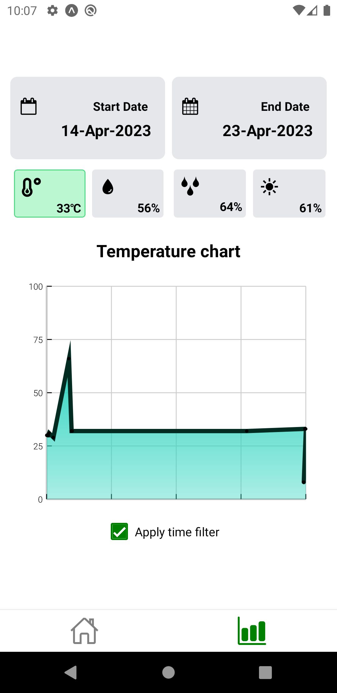

# IoT_mobile_project

### Note
Use react native expo

Require: [Nodejs LTS 16.18.0](https://nodejs.org/ko/blog/release/v16.18.0)

Install all dependacies
```
npm install
```

Run app on virtual device of Andriod studio
```
npm run android
```

### Demo

Try the app [here](https://expo.dev/@hoanganhleboy/Iot_app?serviceType=classic&distribution=expo-go) or use your phone to scan the QR code below.
<p align="center">
  <br>
  
  <br>
</p>

**Note:**
For Android device, please download [Expo Go](https://play.google.com/store/apps/details?id=host.exp.exponent&hl=en_US) for best experience.

For iOS device, your built-in camera app is enough.

### Preview Image

<p align="center">
 <br>
<p float="left">





</p>
</br>
</p>